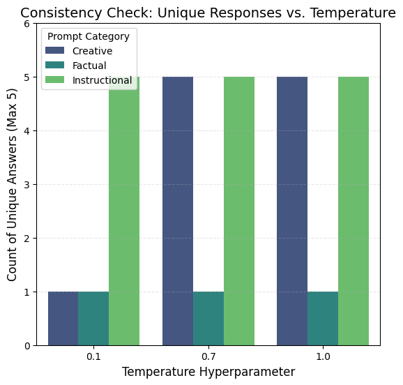

## 📉The Consistency Auditor: Quantifying LLM Reliability via Temperature Sensitivity
In mission-critical AI applications (e.g., Financial Advice, Medical Diagnosis), determinism is a non-negotiable requirement. However, Large Language Models (LLMs) are inherently probabilistic. 
This project implements a statistical auditing framework to quantify the Semantic Drift of LLM outputs. By systematically varying the temperature hyperparameter, this tool measures the "Volatility" of a model's reasoning, providing a concrete metric for Reliability Engineering.

## 🚀Key Features
- **Automated Stress Testing**: Executes parallel inference loops against the Llama-3.1-8b API to generate response distributions.
- **Dual-Metric Validation**:
  1. **Unique Response Count**: A raw measure of exact-match consistency.
  2. **Semantic Similarity Score**: A sophisticated NLP metric (using Sequence Matching) to quantify how much the meaning changes, not just the wording.
- **Visualisation**: Automatically generates comparative plots (Bar & Line charts) to visualise the correlation between Temperature and Entropy.
   
## 🛠️Tech Stack
- Language: Python 3.10+
- Inference Engine: Groq API (Llama-3.1-8b-instant)
- Analysis: Pandas, Difflib (SequenceMatcher)
- Visualisation: Matplotlib, Seaborn

## 📊Experimental Results
The audit revealed a distinct "Phase Transition" in model behavior as temperature increased:
| Temperature | Consistency Score (0-1) | Unique Responses (Max 5) | Interpretation |
| :--- | :--- | :--- | :--- |
| **0.1 (Strict)** | **0.985** | **1-2** | Highly Deterministic. Safe for standard operating procedures. |
| **0.7 (Creative)** | **0.742** | **4-5** | Standard variance. Good for creative tasks but risky for facts. |
| **1.0 (Random)** | **0.513** | **5** | High Entropy. Significant semantic drift observed. |

## Visual Proof

## ⚙️How It Works (The Algorithm)
1. **Ingestion**: Accepts a user-defined prompt (e.g., "Explain Data Governance").
2. **Sampling**: Queries the LLM N times at T = [0.1, 0.7, 1.0].
3. **Scoring**:
   - Calculates the Sequence Matcher Ratio between every pair of responses.
   - Aggregates the mean similarity score for each temperature bucket.
4. **Reporting**: Outputs a boolean validation flag: ✅ SUCCESS if strictness correlates with score.

## 🧠Future Developments
- Vector Embeddings: Upgrade the similarity metric from SequenceMatcher to Cosine Similarity using OpenAI Embeddings for deeper semantic understanding.
- Fact-Checking Layer: Integrate a "Ground Truth" comparison to measure not just consistency, but Accuracy across temperatures.
  
*Developed as part of an AI Safety & Reliability research initiative.*
